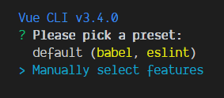
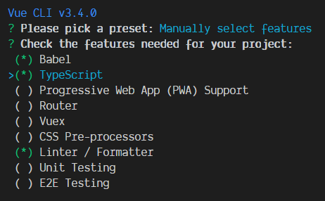
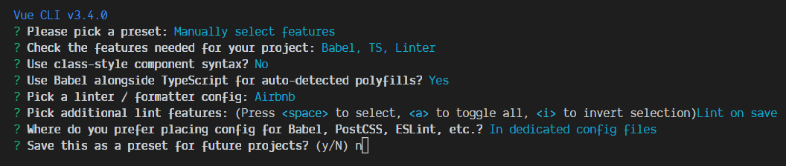

# Vue CLI

Anteriormente vimos cómo podíamos integrar Vue en un sitio web, pero si queremos montar nuestra aplicación para sacar el máximo partido a Vue, lo mejor es hacerlo mediante la herramienta estándar de desarrollo [Vue CLI 3](https://cli.vuejs.org/) que nos proporciona el framework.

Primero la instalamos de forma global:

```
npm install -g @vue/cli
```

Y seguidamente, creamos nuestro proyecto:

```
vue create todo-app
```

Nosotros vamos a meternos directamente con lo duro así que crearemos el proyecto seleccionando la configuración para poder agregar TypeScript.







Una vez ha finalizado, ya tenemos nuestra app lista para funcionar: `npm run serve`

Vamos a eliminar algunas cosas que nos han creado por defecto como el componente `HelloWorld`, agregar un fichero de estilos [public/style.css](./public/style.css) para ir más rápido (no olvides agregar el link al fichero en [public/index.html](./public/index.html)) y dejaremos la aplicación como en el ejemplo anterior:

### [src/App.vue](./src/App.vue)

```html
<template>
  <div id="app">
    
    <h1>{{ header }}</h1>
    <input type="text" v-model="header">
  </div>
</template>

<script lang="ts">
import Vue from 'vue';

export default Vue.extend({
  name: 'app',
  data() {
    return {
      header: 'ToDo list',
    };
  },
});
</script>

```

### Vetur

Si utilizamos VS Code, es muy recomendable instalar la extensión [Vetur](https://vuejs.github.io/vetur) que, a parte de darnos un resaltado de sintaxis acorde, nos permitirá acceder a los snippets de plantillas.

### ESLint

Al haber añadido [ESLint](https://github.com/vuejs/vue-cli/tree/dev/packages/%40vue/cli-plugin-eslint) como linter para TypeScript (en mi caso con la guía de AirBnb), podremos hacer uso de las características de detección de fallos y corrección automática que te proporciona. Sin embargo, primero tenemos que activar las configuración para que comience a validar nuestro código.

Vamos a `File > Preferences > Settings` o `Ctrl+,`

Escribimos `eslint validate` y primero activamos `Validate vue-html in <template> using eslint-plugin-vue` y segundo, agregamos Vue y TypeScript como lenguajes a validar:

```json
"eslint.validate": [
  "javascript",
  "javascriptreact",
  "typescript",
  {
    "language": "vue",
    "autoFix": true
  }
]
```

[Volver al índice](../README_ES.md/#agenda)
